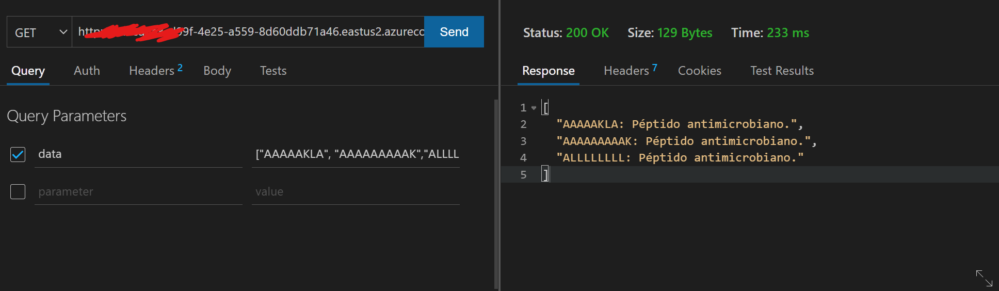

# Clasificación de peptidos utilizando XGBoost en Azure

Esta entrega para el curso de procesamiento de datos en la nube busca resolver el problema de la clasificación de peptidos antimicrobianos.

La solución consiste en cinco pasos:

1. Obtención del dataset: 9000 secuencias antimicrobianas y 9000 no-antimicrobianas adquiridas a partir de varias fuentes de peptidos y proteinas. Las secuencias están en un rango de entre 6 y 35 aminoacidos y deben estar en el siguiente listado de aminoacidos: ['A', 'R', 'N', 'D', 'C', 'Q', 'E', 'G', 'H', 'I', 'L', 'K', 'M', 'F', 'P','S','T','W','Y', 'V'].
   Archivos involucrados:
	- data/NEGATIVOS_FINAL_RANDOMTAILS_SINREPES.fa: secuencias negativas fuente.
	- data/POSITIVOS_CDHIT09_6-35_sinX.fa: secuencias positivas depuradas.

 

2. Montaje del ambiente de trabajo en Azure ML: en este paso se prepara el ambiente de Azure. Para esto, se guardan los identificadores de suscripción y usuario en el archivo secreto secret.json. El ambiente se monta con los archivos del ambiente en cloud-env.yml.
	Archivos involucrados:
	- .azureml/clound-env.yml: archivo de ambiente virtual de conda con las librerias necesarias.
	- 01-create-workspace.py: se crea el ambiente de trabajo o se carga uno existente dependiendo de la elección del usuario. En ambos casos, se guarda la configuración para que los otros archivos la usen en .azureml.
	- 02-create-compute.py: se crea una instancia de computo sencilla para ejecutar las pruebas.

3. Extracción de características: a cada secuencia se le extraen características fisicoquímicas con el fin de alimentar un modelo de clasificación. Esto resulta en un .csv de secuencias negativas y otro de positivas. Ambos se suben a la nube de Azure.

   Archivos fuente involucrados:
	- src/feature.py: módulo de extracción de características.
	- src/calculate_features.py: rutina que procesa los .fa para extraer las características y las guarda en los archivos abajo.
	- data/neg.csv: péptidos no-antimicrobianos y sus características.
	- data/pos.csv: péptidos antimicrobianos y sus características.

	Archivos Azure involucrados:
	- 03-upload-data.py: se suben los datos a la nube de Azure.

4. Clasificación en la nube: se usa el modelo XGBoost para clasificar las secuencias en la nube de Azure mediante ML studio. Al tratarse de un algoritmo basado en árboles, no se hace escalamiento de datos. El modelo se guarda como archivo .pkl.
   	Archivos fuente involucrados:
	- secret.json: archivo no sincronizado con los identificadores, contiene un diccionario como:
		{
			"subscription_id":"xxxxxxxxxxxxxxxx",
			"tenant_id":"xxxxxxxxxxxxxx"
		}
	- src/train-remote.py: archivo para entrenar el modelo.

	Archivos Azure involucrados:
	- 04-run-model-remote: entrena el modelo en una instancia de computo de Azure, que se generó en el 02.

5. Despliegue: Una vez entrenado el modelo, se registra y se pueden mandar péptidos al endpoint tal como ["AAAAAAKLA","AAAAAALLLAK"]. Archivos involucrados:
   - src/pepfilter.py: filtra los péptidos para que cumplan las condiciones.
   - src/score.py: aplica el modelo y devuelve los resultados.

Punto de acceso en funcionamento:

